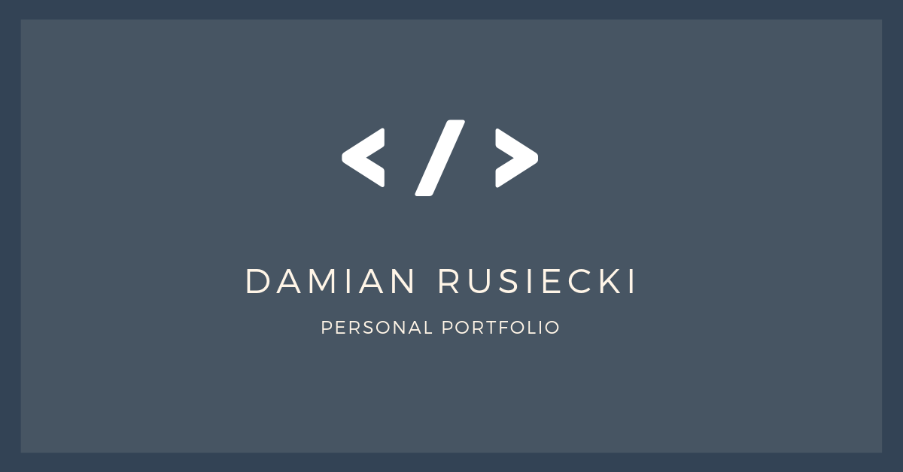

# Damian Rusiecki - Personal Website

My personal website built during WTF course 🔥. 

## Tools & technologies I've used 
- Figma
- Visual Studio Code
- Git
- HTML5
- SASS
- CSS Grid
- Flexbox
- Fetch API
- JavaScript
- Markdown
- Progressive web apps
- NPM Scripts

### Built with wtf-gulp-starter

`npm install -g gulp-cli`

`npm install`

`gulp`

To publish your page using github pages use `npm run deploy`
